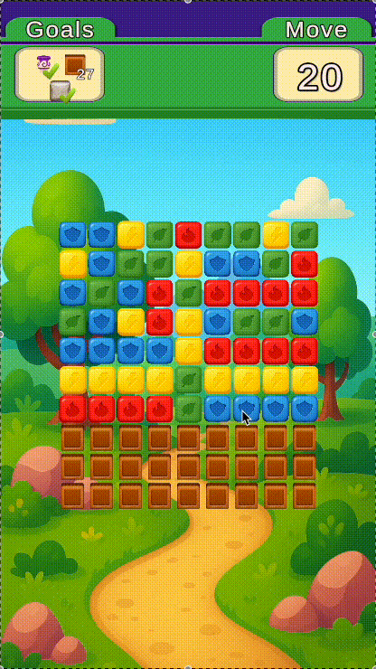
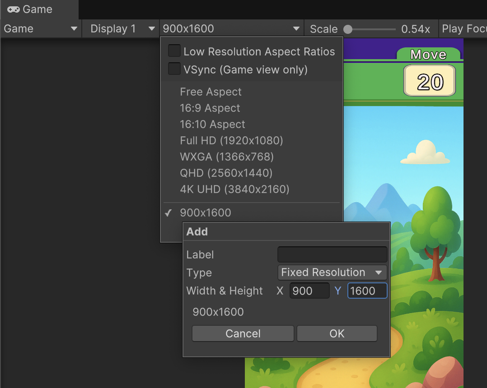

# Blast

A **Blast-type puzzle game** built in Unity while learning game development.  
Since this was a beginning project, it is not well designed and lacks proper OOP practices and optimizations (e.g., inheritance, object pooling). I might update it in the future.

## Gameplay

## Setup
- Please add `900x1600` fixed resolution to the aspect ratio menu before playing.  

- Start the game by loading **MainScene** from the `Scenes` folder.

## How to Play
- Tap with **left mouse button** to blast cubes.  
- You can place rockets on the clicked Cube with the **right mouse button** (debug purposes).  
- All the expected features are implemented.  

## Editor Notes
- You can set the last level from the top editor menu → **Tools → Set Last Played Level**.  
